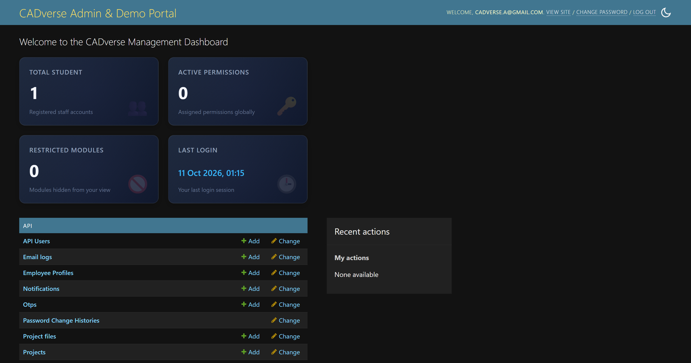
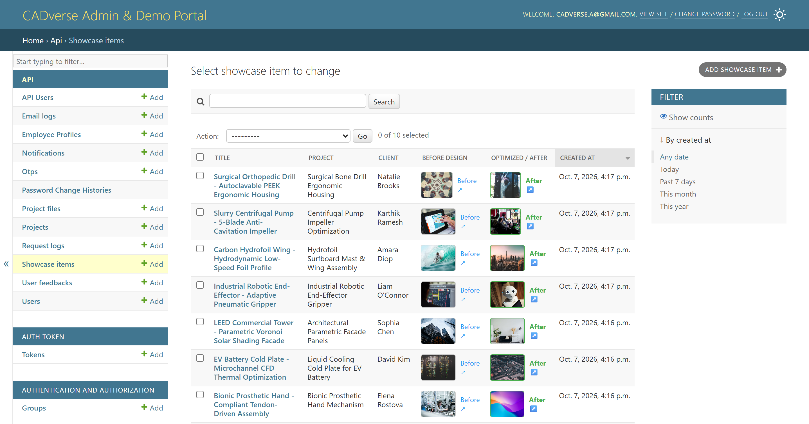
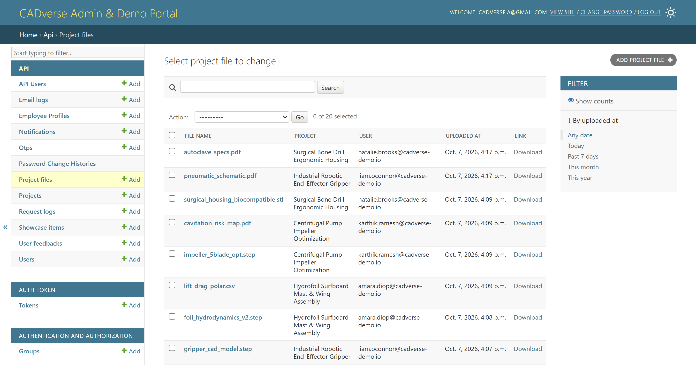
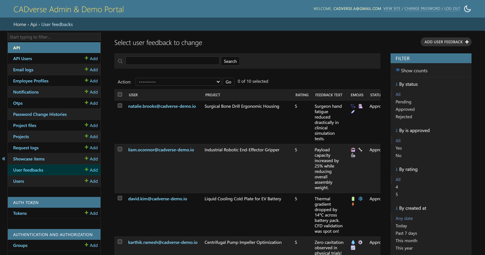

# 🛠️ CADverse Platform Backend: CAD Project API & Read-Only Demo Admin

> A Django REST Framework backend for a cloud engineering platform that handles 3D CAD/CAE project requests, engineering file uploads, client reviews, and a Before & After design showcase, with a read-only public demo admin.

[](https://www.djangoproject.com/)
[](https://www.django-rest-framework.org/)
[](https://supabase.com/)
[](https://render.com/)
[](LICENSE)

---

## 📸 Screenshots

| Admin Dashboard | Before & After Showcase |
| :---: | :---: |
|  |  |

| Projects and Files | Client Feedback |
| :---: | :---: |
|  |  |

---

## 🌐 Live Demo

> [!NOTE]
> Hosted on Render's free tier, so the **first request may take 30-50 seconds** while the server wakes up.

| | |
| :--- | :--- |
| **Admin URL** | [https://cadverse-platform-backend.onrender.com/admin/](https://cadverse-platform-backend.onrender.com/admin/) |
| **Demo email** | `demo_admin@cadverse.com` |
| **Demo password** | `DemoAdmin@123` |
| **Access** | **Read-only**: you can browse everything, but add, edit, delete, and bulk actions are blocked |
| **Frontend repo** | [cadverse-frontend](https://github.com/s-akhil-08/cadverse-frontend) |

All demo data is fictional and may be reset periodically.

---

## 🧰 Tech Stack

- **Backend:** Python, Django 5.2, Django REST Framework 3.16
- **Database:** PostgreSQL on Supabase (connection pooling)
- **File storage:** Supabase Storage buckets
- **Auth:** token authentication with a custom case-insensitive email backend
- **Email:** SMTP (Gmail TLS) with a custom signal-driven email backend
- **Serving:** Gunicorn and WhiteNoise
- **Deployment:** Render

---

## ✨ Features

### 🔐 Dual-Role Admin Security
- **`RestrictedAdminMixin`** overrides `has_add_permission`, `has_change_permission`, `has_delete_permission`, and `get_actions` for demo accounts, so every write is blocked on the server and raises `PermissionDenied`.
- **Master-admin privacy:** superuser and administrator accounts are filtered out of user lists, logs, and employee panels during demo sessions.
- **Employee permissions (`EmployeeProfile`):** administrators can control which admin panels each staff user can see.

### 📁 CAD/CAE Project and File Pipeline
- Endpoints to submit and track 3D CAD modeling, 3D printing, and FEA/CFD simulation jobs
- Direct upload to **Supabase Storage** for engineering formats (`.step`, `.stl`, `.iges`, `.sldasm`, `.pdf`)
- Live project status updates through **Server-Sent Events (SSE)**

### 🖼️ Before & After Showcase
- Connects approved client feedback with design-optimization results
- Inline thumbnails and links in the admin changelist

### ✉️ Email System
- Admin tool to send custom HTML or plain-text emails to selected clients with placeholders (`{{ name }}`, `{{ project_name }}`, `{{ email }}`)
- Signal-triggered emails on signup, project upload, and review approval

### ⚡ Standalone OTP and Email Service
- A separate service in `OTP project/` for 6-digit verification codes, cache-backed password resets, and independent email triggers

### 🍪 Secure Cookies and CORS
- `SESSION_COOKIE_SECURE` and `CSRF_COOKIE_SECURE` for HTTPS-only cookies in production
- `SESSION_COOKIE_HTTPONLY = True` so JavaScript cannot read session cookies
- `CORS_ALLOW_CREDENTIALS` with `SameSite=None` for a Vercel frontend talking to a Render backend
- `SECURE_PROXY_SSL_HEADER` for correct HTTPS handling behind Render's proxy

---

## 📁 Project Structure

```text
cadverse-platform-backend/
├── api/                         # Core API app
│   ├── migrations/
│   ├── management/commands/     # seed_demo_data, setup_admin_accounts
│   ├── admin.py                 # Dual-role admin and RestrictedAdminMixin
│   ├── admin_config.py          # Admin configuration
│   ├── backends.py              # Case-insensitive email auth
│   ├── email_backends.py        # Signal-driven SMTP mailer
│   ├── forms.py                 # Admin and employee forms
│   ├── models.py                # User, Project, ProjectFile, UserFeedback, ShowcaseItem
│   ├── serializers.py
│   ├── signals.py               # Post-save notifications
│   ├── urls.py
│   └── views.py
├── myproject/                   # Settings, root URLs, WSGI
├── templates/
│   ├── admin/                   # Admin overrides and mailer templates
│   └── emails/                  # OTP, welcome, feedback, upload emails
├── OTP project/                 # Standalone OTP and email service
├── .env.example
├── build_files.sh
├── Procfile
├── requirements.txt
├── vercel.json
├── LICENSE
└── README.md
```

---

<details>
<summary><b>🔌 API Reference (click to expand)</b></summary>

### Authentication
| Method | Endpoint | Description | Access |
| :--- | :--- | :--- | :--- |
| `POST` | `/api/signup/` | Register and send 6-digit OTP | Public |
| `POST` | `/api/verify-otp/` | Verify OTP and activate account | Public |
| `POST` | `/api/login/` | Email and password login, returns token | Public |
| `POST` | `/api/logout/` | Revoke token | Authenticated |
| `POST` | `/api/forgot-password/` | Send 5-minute reset OTP | Public |
| `POST` | `/api/verify-forgot-otp/` | Validate reset OTP, issue reset token | Public |
| `POST` | `/api/reset-password/` | Set new password | Public |

### Projects and Files
| Method | Endpoint | Description | Access |
| :--- | :--- | :--- | :--- |
| `GET` | `/api/projects/` | List the user's projects | Authenticated |
| `GET` | `/api/projects/<id>/` | Project details and files | Authenticated |
| `POST` | `/api/upload-file/` | Upload CAD file to Supabase | Authenticated |
| `GET` | `/api/project-status-stream/` | Live status stream (SSE) | Authenticated |

### Reviews and Showcase
| Method | Endpoint | Description | Access |
| :--- | :--- | :--- | :--- |
| `POST` | `/api/submit-feedback/` | Submit rating and review | Authenticated |
| `GET` | `/api/feedbacks/` | Approved public reviews | Public |
| `GET` | `/api/showcase/` | Before & After showcase | Public |
| `GET` | `/api/feedback-stats/` | Ratings and satisfaction % | Public |
| `GET` | `/api/employee-permissions/` | Admin panel access rights | Staff |

</details>

---

## ⚙️ Environment Variables

Copy `.env.example` to `.env` and fill in your values. Never commit the real `.env` file.

```bash
cp .env.example .env        # Windows: copy .env.example .env
```

Generate a Django secret key:

```bash
python -c "from django.core.management.utils import get_random_secret_key; print(get_random_secret_key())"
```

---

## 🚀 Local Setup

```bash
# 1. Clone
git clone https://github.com/s-akhil-08/cadverse-platform-backend.git
cd cadverse-platform-backend

# 2. Virtual environment
python -m venv venv
source venv/bin/activate         # Windows: .\venv\Scripts\activate

# 3. Install dependencies
pip install -r requirements.txt

# 4. Configure environment (see above)

# 5. Migrate and seed demo data
python manage.py migrate
python manage.py setup_admin_accounts
python manage.py seed_demo_data

# 6. Run
python manage.py runserver
```

Open the admin at `http://127.0.0.1:8000/admin/`.

---

## 🚢 Deployment (Render)

1. Add the variables from `.env.example` in the Render dashboard.
2. **Build command:** `./build_files.sh` (or `pip install -r requirements.txt && python manage.py collectstatic --noinput && python manage.py migrate`)
3. **Start command:** `gunicorn myproject.wsgi:application --bind 0.0.0.0:$PORT`

---

## 💡 Design Decisions

- **Demo protection on the server, not the UI.** Write permissions are removed in the admin classes, so even a direct request can't change data.
- **Hiding master accounts from demo sessions** so visitors can never see real admin credentials or activity.
- **A separate OTP microservice** keeps verification and email logic independent from the main API.
- **SSE for project status** gives live updates with a simpler setup than WebSockets.

---


## 📄 License

Licensed under the [MIT License](LICENSE).